# Mini-Project-2

## The Team: 
Chhavi Nijhawan, Anuj Pratap Singh, Kumar Yash, and Hayden Myers.

## Problem Statment: 
Identification of clients who will subscribe for a term deposit through classification.

## The Data:
Dataset: XYZ_Bank_Deposit_Data_Classification.csv​
Rows: 411,89​
Columns: 20​
Time Range: May 2008 – November 2010

## Exploratory Data Analysis:
The aim of the EDA conducted was to:​
1. Identify relationships between variables​
2. Variable distribution analysis​
3. Distinguishing between categorical and numerical attributes​
4. Null values identification​
5. Cardinality for the categorical variables​
6. Statistics for numeric variables.
7. Evaluating model accuracy and performance

## Pearson Correlation and Variable Distributin Plots
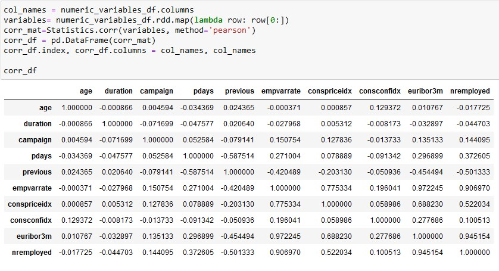
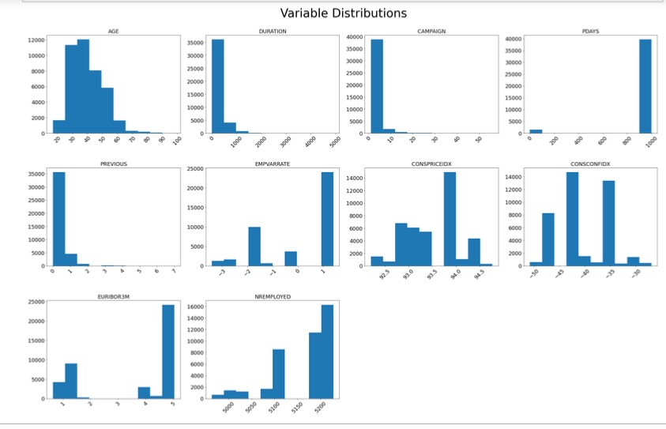
## Attributes Distinction, Null Values and Cardinality
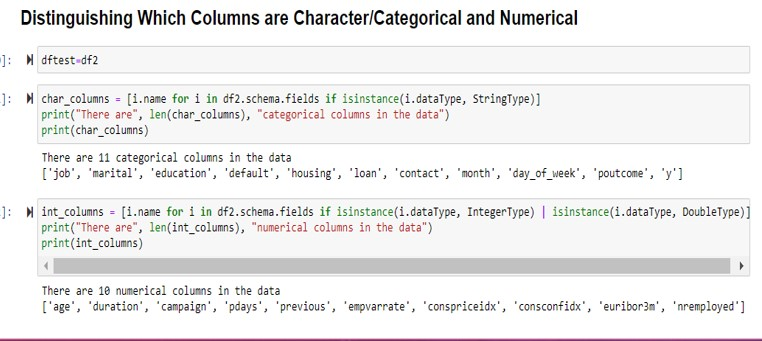
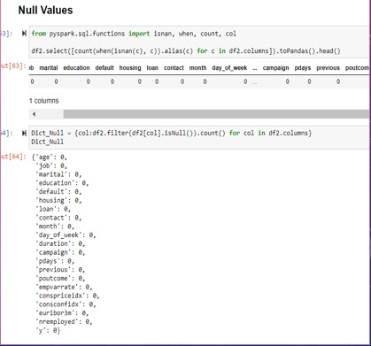
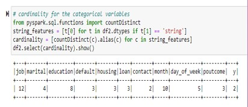
## Variables Statistics and Number of Null and Distinct Values
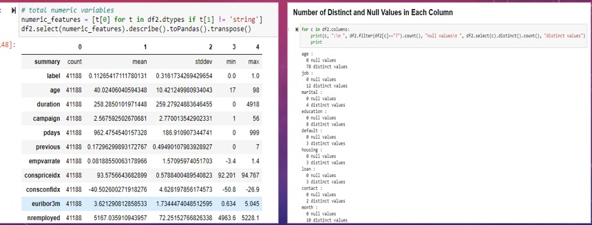
## Prective Models 
1. Logistic Regression​
2. Decision Tree​
3. Random Forest ​
4. Gradient Boosted Tree Classifier​
5. K-Means​
6. Linear SVC 

## Logistic Regression results
Accuracy: 91.005%
Testing Area Under ROC: 93.68%

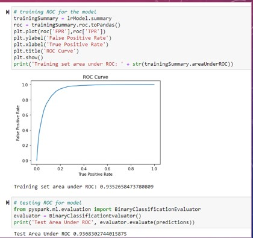
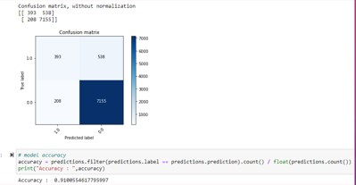

## Decision tree Results
Accuracy: 91.43%
Testing Area Under ROC: 74.96%

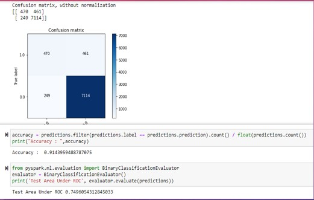

## Random Forest Results
Accuracy: 90.16%
Testing Area under ROC: 92.12%

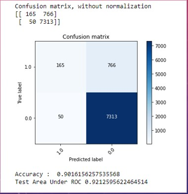

## Gradient Boosting Tree Results
Testing Area under ROC: 93.67%

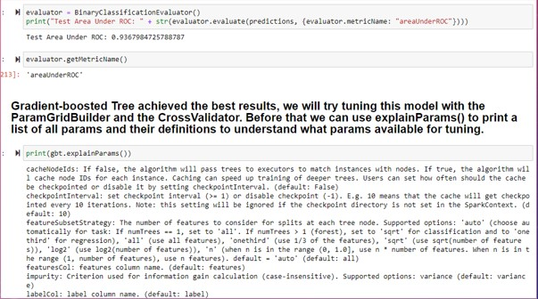

## K-MEANS Clustering
Accuracy: 81.27%
Test Area under ROC: 92.12%

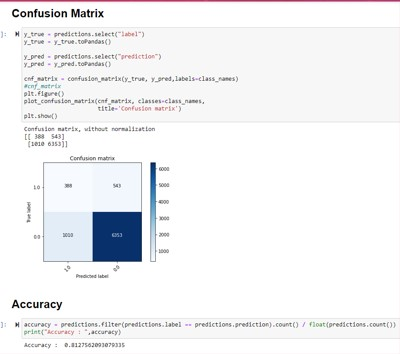

## Linear SVC
Accuracy: 90.40%
Test Area under ROC: 92.63%

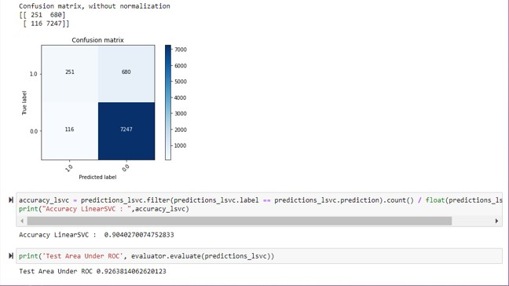

## Best model evaluation
Logistic Regression comes out to be the best performing model amongst all

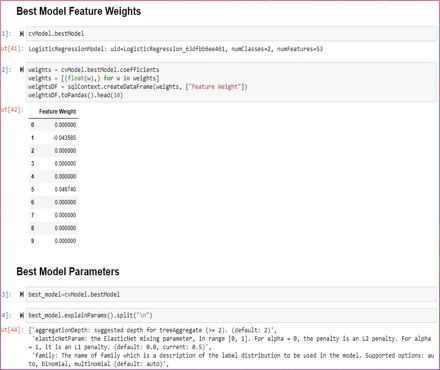
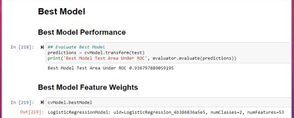

## Prescriptive Recommendations

1. Offer more ads to the people that were correctly predicted to subscribe for term deposits​
Example:  send frequent e-mails, text messages etc.
2. Give future clients a deal on deposits who are already subscribed and those who are willing to in the future to draw in more business. ​
3. With people who are correctly predicted to not come and use the term deposits, ask them in a questionnaire what could be improved to get their business. 
4. Use social media to push a campaign for the term deposits to broaden the scope of potential clients/customers. 

## Conclusion

1. High values for AUC for almost all models
2. Logistic Regression leads amongst all the models
3. Decision Tree did not work as well as anticipated, the AUC was quite low even though accuracy was high.
4. K-Means had lowest accuracy (82%) and with two clusters in it
